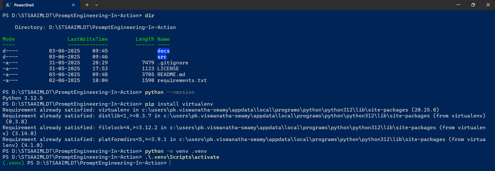
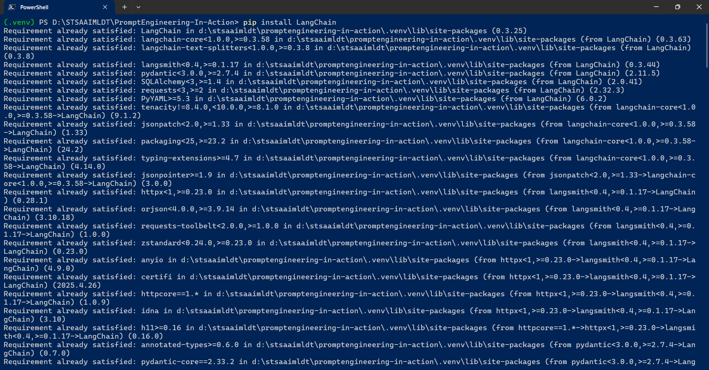
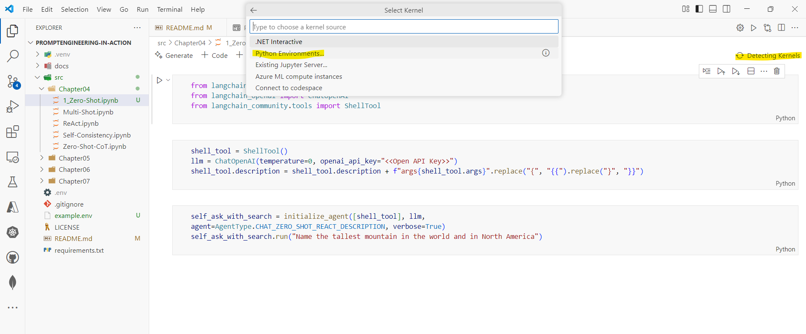
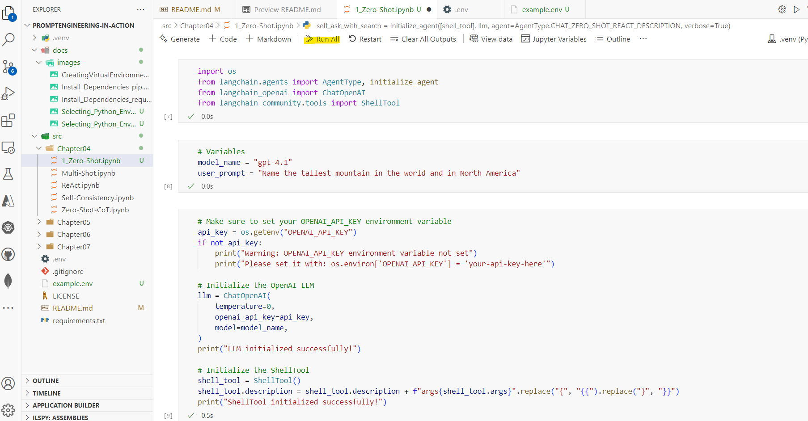

# PromptEngineering-In-Action

This is the code repository for [Prompt Engineering In Action](https://www.manning.com/books/prompt-engineering-in-action), published by Manning

## What is this book about?

Prompt Engineering in Action teaches you practical prompt engineering skills including:

This book covers the following topics:

- Designing context-aware prompts tailored for specific tasks
- Understanding and minimizing hallucinations
- When to use prompt patterns such as Persona, Recipe, Template, and Game-Play
- Utilizing templates to ensure consistent and reusable outputs
- Integrating external knowledge bases with Retrieval-Augmented Generation (RAG)
- Building and deploying practical LLM-based apps using LangChain

Prompt Engineering in Action presents patterns, templates, and techniques that help you get consistent, valuable responses from LLMs. You’ll learn how to design precise and context-aware prompts, discover metrics you can use to assess prompt quality, learn methods to scale and collaborate on prompts, and build advanced and agentic AI apps using LangChain.

## Get to know the Authors

**Naresh Vurukonda** has been working in the fields of Data Engineering, Machine learning, and Artificial Intelligence for more than a decade. Naresh is an engineer who has worked in various industries, including Amgen, Viacom Media Networks, and Valuelabs, where he led the Data Engineers and Artificial Intelligence associates. He holds a master’s degree in computer science from Southern Arkansas University.

Naresh is an Information Systems Associate Director at Amgen, where he focuses on building Deep learning models and LLM solutions to enhance engineers’ productivity and serve patients on drug accessibility. You can learn more about Naresh at [LinkedIn](https://www.linkedin.com/in/nareshvurukonda).

**Shivendra Srivastava** has more than a decade of experience working in the field of Cloud/Distributed Computing, Machine Learning and Artificial Intelligence. Shivendra is an experienced engineer and engineering manager who has worked across various industries such as Retail, Pharmacy and more recently in Cloud Computing companies. He holds a Master’s degree in computer science from Georgia Institute of Technology.

Shivendra is an Engineering Manager at AWS, where he focuses on building highly available, low latency and scalable serverless solutions that power AWS Lambda, Athena, Glue and Bedrock. You can learn more about Shivendra at [LinkedIn](https://www.linkedin.com/in/shivendrasrivastava).

## References

- [LangChain](https://www.langchain.com/)

## Creating a new Virtual Environment

To create a new virtual environment, you can use the following command:

### For Windows PowerShell

```powershell
python --version

pip install virtualenv
python.exe -m pip install --upgrade pip # Install the latest version of pip if needed

python -m venv .venv
.\.venv\Scripts\activate
python.exe -m pip install --upgrade pip # Install the latest version of pip if needed
```



## Installing Dependencies

To install the dependencies for this project, you can use the following command:

```powershell
# For Windows PowerShells
pip install LangChain
pip install langchain-openai
pip install langchain-community
pip install langchain_experimental
pip install ipykernel
pip install pandas
pip install tabulate
python.exe -m pip install --upgrade pip # Install the latest version of pip if needed
```

!

## If you have a `requirements.txt` file, you can install all the dependencies listed in it by running

```powershell
pip install -r requirements.txt
```


## Running the Code

To run the code in this repository, you can use the following steps

> 1. Open the code in VS Code.
> 1. Make sure your virtual environment is activated.
> 1. Open any of the notebook. In our example, we will open `src\Chapter04\1_Zero-Shot.ipynb`.
> 1. Select the Python interpreter that corresponds to your virtual environment.
> 1. Please rename the example.env file to `.env` in the `src\Chapter04` directory. This file contains the OpenAI API key and other environment variables required to run the code.
>    - You can set the OpenAI API key in the `.env` file as follows:
> 1. You can also set the OpenAI API key in the environment variables of your operating system.
> 1. Run the code cells in the notebook.
> 1. You can run the code cells by clicking on the `Run All` button in the top menu or by using the keyboard shortcut `Shift + Enter`.

### Setting the OpenAI API Key

```text
OPENAI_API_KEY=your_openai_api_key_here
```

### Selecting the Python Interpreter




### Running the Notebook



## Contributing

We welcome contributions to this repository. If you have suggestions, bug reports, or improvements, please open an issue or submit a pull request.

## License

This project is licensed under the MIT License. See the [LICENSE](LICENSE) file for details.
